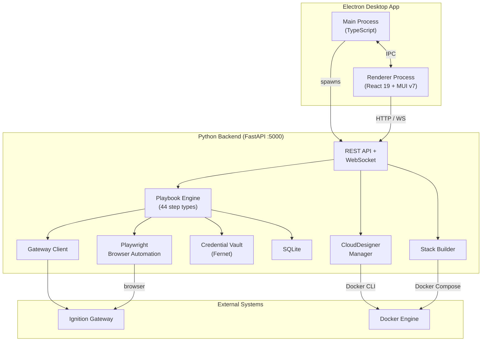

# Architecture Documentation

**Project:** Ignition Toolbox
**Last Updated:** 2026-02-06
**Version:** 1.5.3

This document provides comprehensive architecture documentation including system design, component interactions, data flow, and key architectural decisions (ADRs).

---

## Table of Contents

1. [System Architecture Overview](#system-architecture-overview)
2. [Technology Stack](#technology-stack)
3. [Component Architecture](#component-architecture)
4. [Data Flow](#data-flow)
5. [Security Architecture](#security-architecture)
6. [Architectural Decision Records (ADRs)](#architectural-decision-records-adrs)

---

## System Architecture Overview



Ignition Toolbox is a **visual acceptance testing platform** for Ignition SCADA with the following architectural layers:

### Electron Main Process

The Electron main process (`electron/`) manages the application lifecycle:

| File | Purpose |
|------|---------|
| `main.ts` | App entry, window creation, lifecycle |
| `preload.ts` | Context bridge exposing IPC to renderer |
| `services/python-backend.ts` | Spawns and monitors the Python subprocess |
| `services/auto-updater.ts` | GitHub-based auto-updates |
| `services/settings.ts` | Persistent app settings (electron-store) |
| `ipc/handlers.ts` | IPC handler registration |

The main process spawns the Python backend as a child process and communicates with the renderer via IPC. In development, the renderer loads from the Vite dev server; in production, it loads from the bundled frontend build.

### Backend + Frontend Layers

```
┌─────────────────────────────────────────────────────────────────┐
│                     Frontend (React 19 + TypeScript)            │
│  ┌────────────────┐  ┌────────────────┐  ┌────────────────┐   │
│  │   Playbooks    │  │  Executions    │  │  Credentials   │   │
│  │     Page       │  │     Page       │  │     Page       │   │
│  └────────────────┘  └────────────────┘  └────────────────┘   │
│         │                    │                    │             │
│         └────────────────────┼────────────────────┘             │
│                              │                                   │
│                    WebSocket + REST API                          │
└──────────────────────────────┼──────────────────────────────────┘
                               │
┌──────────────────────────────┼──────────────────────────────────┐
│              Backend (Python 3.10+ / FastAPI)                    │
│  ┌────────────────┐  ┌────────────────┐  ┌────────────────┐   │
│  │   API Layer    │  │ Execution      │  │   Browser      │   │
│  │  (19 Routers)  │  │   Engine       │  │   Manager      │   │
│  └────────────────┘  └────────────────┘  └────────────────┘   │
│         │                    │                    │             │
│         │           ┌────────┼────────┐           │             │
│         │           │                 │           │             │
│  ┌────────────────┐ │  ┌─────────────────────┐   │             │
│  │   Gateway      │ │  │   Playbook          │   │             │
│  │   Client       │ │  │   Loader/Resolver   │   │             │
│  └────────────────┘ │  └─────────────────────┘   │             │
│         │           │                             │             │
└─────────┼───────────┼─────────────────────────────┼─────────────┘
          │           │                             │
┌─────────┼───────────┼─────────────────────────────┼─────────────┐
│                      Storage Layer                               │
│  ┌────────────────┐  ┌────────────────┐  ┌────────────────┐   │
│  │    SQLite      │  │  Credential    │  │   Playbook     │   │
│  │   Database     │  │     Vault      │  │   Library      │   │
│  │  (Executions)  │  │  (Encrypted)   │  │    (YAML)      │   │
│  └────────────────┘  └────────────────┘  └────────────────┘   │
└──────────────────────────────────────────────────────────────────┘
          │                     │                    │
┌─────────┼─────────────────────┼────────────────────┼─────────────┐
│                      External Systems                            │
│  ┌────────────────┐  ┌────────────────┐  ┌────────────────┐   │
│  │   Ignition     │  │   Perspective  │  │  Docker        │   │
│  │   Gateway      │  │   Web Client   │  │  Engine        │   │
│  │  (REST API)    │  │   (Browser)    │  │  (Containers)  │   │
│  └────────────────┘  └────────────────┘  └────────────────┘   │
└──────────────────────────────────────────────────────────────────┘
```

### Key Architectural Characteristics

1. **Domain Separation** - Gateway, Perspective, and Designer playbooks are kept separate
2. **Visual Feedback** - Real-time browser streaming (2 FPS) during Perspective tests
3. **Async-First** - Python asyncio throughout for I/O operations
4. **Type-Safe** - TypeScript frontend, Python type hints backend
5. **Modular** - Pluggable step executors, composable playbooks
6. **Secure** - Fernet-encrypted credentials, never in playbooks or git

---

## Technology Stack

### Backend Stack

| Component | Technology | Version | Purpose |
|-----------|------------|---------|---------|
| **Runtime** | Python | 3.10+ | Core language |
| **Web Framework** | FastAPI | 0.115.0+ | REST API + WebSocket |
| **HTTP Client** | httpx | 0.27.0+ | Async Gateway API calls |
| **Browser Automation** | Playwright | 1.49.0+ | Perspective testing |
| **Database** | SQLite + SQLAlchemy | 2.0.35+ | Execution history |
| **Encryption** | cryptography (Fernet) | 44.0.0+ | Credential vault |
| **Playbook Parser** | PyYAML | 6.0.2+ | YAML parsing |
| **Data Validation** | Pydantic | 2.10.0+ | Type-safe models |
| **CLI Framework** | Click + Rich | 8.1.7+ / 13.9.0+ | Command-line interface |
| **WebSocket** | websockets | 14.0+ | Real-time updates |
| **AI (Optional)** | Anthropic SDK | 0.42.0+ | Claude integration |

### Frontend Stack

| Component | Technology | Version | Purpose |
|-----------|------------|---------|---------|
| **UI Framework** | React | 19.1.1 | Component-based UI |
| **Language** | TypeScript | 5.9.3 | Type-safe JavaScript |
| **UI Library** | Material-UI (MUI) | 7.3.4 | Professional components |
| **Routing** | React Router | 7.9.4 | Client-side navigation |
| **State Management** | Zustand | 5.0.8 | Global state |
| **Data Fetching** | TanStack Query | 5.90.5 | Server state |
| **Code Editor** | Monaco Editor | 4.7.0 | YAML editing |
| **Terminal** | xterm.js | 5.3.0 | Claude Code terminal |
| **Build Tool** | Vite | 7.1.7 | Fast dev server + bundler |
| **Drag & Drop** | dnd-kit | 6.3.1 / 10.0.0 | Reordering UI |

### Storage Layer

| Component | Technology | Purpose |
|-----------|------------|---------|
| **Execution History** | SQLite (data/toolkit.db) | Step results, execution state |
| **Credentials** | Encrypted JSON (~/.ignition-toolkit/credentials.vault) | Fernet-encrypted passwords |
| **Playbooks** | YAML (playbooks/ directory) | Playbook definitions |
| **UI State** | localStorage (browser) | Theme, saved configs |

---

## Component Architecture

### 1. Frontend Architecture (React 19)

```
frontend/src/
├── pages/                    # Top-level pages (10 pages)
│   ├── Playbooks.tsx         # Playbook library management
│   ├── Executions.tsx        # Live execution monitoring
│   ├── ExecutionDetail.tsx   # Step-by-step results + screenshots
│   ├── Credentials.tsx       # Credential management
│   ├── AICredentials.tsx     # AI API key management
│   ├── Designer.tsx          # CloudDesigner (Docker-based)
│   ├── StackBuilder.tsx      # Docker Compose generator
│   ├── APIExplorer.tsx       # Interactive API browser
│   ├── Settings.tsx          # Application settings
│   └── About.tsx             # Version info + system status
│
├── components/               # Reusable UI components
│   ├── PlaybookCard.tsx      # Playbook display card
│   ├── ExecutionStepper.tsx  # Step-by-step progress
│   ├── LiveBrowserView.tsx   # Live browser feed (2 FPS)
│   ├── ParameterInput.tsx    # Dynamic parameter forms
│   ├── AddCredentialDialog.tsx  # Credential creation
│   └── EditCredentialDialog.tsx # Credential editing
│
├── hooks/                    # Custom React hooks
│   ├── useWebSocket.ts       # WebSocket connection + events
│   ├── usePlaybookOrder.ts   # Playbook ordering
│   ├── useClaudeCode.ts      # Claude Code integration
│   └── useDensity.ts         # UI density settings
│
├── store/                    # Zustand global state
│   └── store.ts              # Theme, app-wide state
│
├── api/                      # API client
│   └── client.ts             # Fetch wrapper for REST API
│
└── App.tsx                   # Root component + routing
```

**Key Frontend Patterns:**

- **Component Composition** - Nested components (PlaybookCard → ExecutionStepper → StepItem)
- **Hooks for Logic** - Custom hooks separate concerns (data fetching, WebSocket, execution)
- **Material-UI Theme** - Custom Warp Terminal-inspired dark theme
- **Real-Time Updates** - WebSocket hooks trigger React state updates
- **Type Safety** - TypeScript interfaces for all API responses

### 2. Backend Architecture (FastAPI)

```
ignition_toolkit/
├── api/                      # FastAPI application
│   ├── app.py                # Core FastAPI app (190 lines, 92% reduction)
│   └── routers/              # Modular routers (ADR-012)
│       ├── health.py         # Health check endpoints
│       ├── playbooks.py      # Playbook CRUD operations
│       ├── executions.py     # Execution control + monitoring
│       ├── credentials.py    # Credential CRUD operations
│       ├── ai.py             # AI assistant endpoints
│       ├── websockets.py     # WebSocket endpoints + broadcast
│       └── models.py         # Shared Pydantic models
│
├── playbook/                 # Playbook execution engine
│   ├── loader.py             # YAML parser + validation
│   ├── parameters.py        # Parameter resolution ({{ parameter.x }})
│   ├── step_executor.py     # Step execution coordinator
│   ├── engine.py             # Main execution engine
│   └── state_manager.py     # Pause/resume/skip state manager
│
├── gateway/                  # Gateway REST API client
│   ├── client.py             # Async httpx client
│   ├── models.py             # Gateway data models (Module, Project, etc.)
│   └── operations.py         # Gateway operations (upload, restart, etc.)
│
├── browser/                  # Browser automation (Playwright)
│   ├── manager.py            # Browser lifecycle management
│   └── recorder.py           # Screenshot capture
│
├── credentials/              # Credential management
│   ├── vault.py              # Fernet encryption/decryption
│   └── models.py             # Credential data models
│
├── storage/                  # SQLite database
│   ├── database.py           # SQLAlchemy setup + session management
│   └── models.py             # ORM models (ExecutionModel, StepResultModel)
│
├── ai/                       # AI assistant (optional)
│   ├── client.py            # Claude API integration
│   └── prompts.py            # Prompt templates
│
├── clouddesigner/            # CloudDesigner
│   ├── manager.py            # Docker container lifecycle for Designers
│   └── docker_files/         # Dockerfiles, nginx config, compose
│
├── stackbuilder/             # Stack Builder
│   ├── builder.py            # Docker Compose generation
│   └── services/             # Service catalog (25+ services)
│
├── auth/                     # Authentication + authorization
│   └── api_keys.py           # API key management, RBAC
│
├── execution/                # Execution queue
│   └── queue.py              # Parallel execution with resource limiting
│
├── reporting/                # Reports + analytics
│   └── generator.py          # Trend reports, CSV/PDF exports
│
└── designer/                 # Designer automation
    └── manager.py            # Designer step handlers
```

**Key Backend Patterns:**

- **Async/Await** - All I/O operations are async (httpx, Playwright, SQLite via aiosqlite)
- **Dependency Injection** - Functions access global state via `get_X()` factories
- **Type Hints** - Every function parameter and return type is annotated
- **Context Managers** - Database sessions, browser contexts use `async with`
- **Domain Separation** - Step executors organized by domain (gateway/, browser/)

### 3. Execution Engine Architecture

The playbook execution engine is the core of the system:

```
┌─────────────────────────────────────────────────────────────────┐
│                      Execution Request                           │
│  { playbook_path, parameters, debug_mode, paused }               │
└───────────────────────────────┬─────────────────────────────────┘
                                │
                                ▼
┌─────────────────────────────────────────────────────────────────┐
│                    Playbook Loader (loader.py)                   │
│  • Parse YAML                                                    │
│  • Validate schema                                               │
│  • Check for syntax errors                                       │
└───────────────────────────────┬─────────────────────────────────┘
                                │
                                ▼
┌─────────────────────────────────────────────────────────────────┐
│                 Parameter Resolver (parameters.py)                 │
│  • Resolve {{ parameter.X }}                                     │
│  • Resolve {{ credential.Y.password }}                           │
│  • Substitute environment variables                              │
└───────────────────────────────┬─────────────────────────────────┘
                                │
                                ▼
┌─────────────────────────────────────────────────────────────────┐
│                   Execution Engine (engine.py)                   │
│  • Create execution record in SQLite                             │
│  • Initialize domain context (Gateway client OR Browser)         │
│  • Iterate through steps                                         │
│  • Handle pause/resume/skip via state manager                    │
│  • Broadcast WebSocket updates after each step                   │
└───────────────────────────────┬─────────────────────────────────┘
                                │
                 ┌──────────────┴──────────────┐
                 │                             │
                 ▼                             ▼
┌────────────────────────────┐  ┌────────────────────────────────┐
│   Gateway Step Executor    │  │   Browser Step Executor        │
│  (gateway/ operations)     │  │   (browser/ operations)        │
│  • gateway.login           │  │   • browser.navigate           │
│  • gateway.upload_module   │  │   • browser.click              │
│  • gateway.restart         │  │   • browser.fill               │
│  • gateway.list_modules    │  │   • browser.verify             │
└────────────────────────────┘  └────────────────────────────────┘
                 │                             │
                 └──────────────┬──────────────┘
                                │
                                ▼
┌─────────────────────────────────────────────────────────────────┐
│                   Step Result Recording                          │
│  • Save to SQLite (step_results table)                           │
│  • Store success/failure, duration, output, error                │
│  • Capture screenshots (browser steps)                           │
└───────────────────────────────┬─────────────────────────────────┘
                                │
                                ▼
┌─────────────────────────────────────────────────────────────────┐
│                   WebSocket Broadcast                            │
│  • Broadcast step_completed event to all connected clients       │
│  • Frontend updates UI in real-time                              │
└─────────────────────────────────────────────────────────────────┘
```

**Key Execution Features:**

1. **Domain Context Management** - Gateway client OR Browser, never both
2. **State Management** - Pause/resume/skip handled by state manager
3. **Real-Time Updates** - WebSocket broadcasts after each step
4. **Error Handling** - on_failure: abort/continue/skip
5. **Screenshot Capture** - Automatic screenshots for browser steps
6. **Composability** - playbook.run step type for nested playbooks

---

## Data Flow

### 1. Playbook Execution Flow

```
User clicks "Run" in UI
         │
         ▼
POST /api/executions/start
  { playbook_path: "gateway/module_upgrade.yaml",
    parameters: { gateway_url: "http://localhost:8088", ... },
    debug_mode: false }
         │
         ▼
Backend creates execution record (SQLite)
  execution_id: "abc123..."
  status: "running"
         │
         ▼
Engine starts async task
  • Load YAML playbook
  • Resolve parameters ({{ parameter.gateway_url }})
  • Resolve credentials ({{ credential.admin.password }})
  • Initialize Gateway client OR Browser
         │
         ▼
For each step in playbook:
  ┌─────────────────────────────┐
  │ Execute step                │
  │  • gateway.login            │
  │  • gateway.upload_module    │
  │  • browser.navigate         │
  │  • etc.                     │
  └──────────────┬──────────────┘
                 │
                 ▼
  ┌─────────────────────────────┐
  │ Save step result (SQLite)   │
  │  • success/failure          │
  │  • duration                 │
  │  • output/error             │
  │  • screenshot (if browser)  │
  └──────────────┬──────────────┘
                 │
                 ▼
  ┌─────────────────────────────┐
  │ WebSocket broadcast         │
  │  event: "step_completed"    │
  │  data: { step_id,           │
  │          status,            │
  │          output }           │
  └──────────────┬──────────────┘
                 │
                 ▼
  ┌─────────────────────────────┐
  │ Frontend updates UI         │
  │  • Update ExecutionStepper  │
  │  • Show step output         │
  │  • Display screenshot       │
  └─────────────────────────────┘
         │
         ▼
Execution completes
  • Update execution status: "completed"
  • Broadcast execution_completed event
  • Clean up resources (close browser, Gateway client)
```

### 2. Real-Time Browser Streaming Flow

```
Browser step executes (browser.navigate, browser.click, etc.)
         │
         ▼
Browser Manager captures screenshot (Playwright)
         │
         ▼
Screenshot saved to: data/screenshots/{execution_id}/{step_id}.png
         │
         ▼
WebSocket broadcast: "browser_frame" event
  { execution_id, screenshot_url }
         │
         ▼
Frontend receives WebSocket event
         │
         ▼
LiveBrowserView component updates  src
         │
         ▼
User sees live browser feed (2 FPS)
```

### 3. Credential Flow

```
User creates credential (Web UI or CLI)
         │
         ▼
POST /api/credentials
  { name: "gateway_admin",
    username: "admin",
    password: "password123" }
         │
         ▼
Backend encrypts password (Fernet)
  encrypted_password = fernet.encrypt(b"password123")
         │
         ▼
Save to vault file: ~/.ignition-toolkit/credentials.vault
  {
    "gateway_admin": {
      "username": "admin",
      "password": "gAAAAABh..." (encrypted)
    }
  }
         │
         ▼
During playbook execution:
  • Resolve {{ credential.gateway_admin.password }}
  • Decrypt password using Fernet
  • Use in Gateway API or browser automation
  • Never logged or stored in plaintext
```

---

## Security Architecture

### Threat Model

**Assets to Protect:**
1. Gateway admin credentials
2. Perspective user credentials
3. Execution history (may contain sensitive data)
4. Playbook definitions (may reference sensitive systems)

**Attack Vectors:**
1. Credential theft from storage
2. Credential leakage in logs or exports
3. Unauthorized API access
4. Code injection via playbook YAML

### Security Controls

#### 1. Credential Encryption (Fernet)

```python
# Encryption at rest
from cryptography.fernet import Fernet

key = Fernet.generate_key()  # Stored in ~/.ignition-toolkit/
fernet = Fernet(key)

# Encrypt
encrypted = fernet.encrypt(b"password123")
# Result: b'gAAAAABh...' (AES-128-CBC + HMAC)

# Decrypt (only when needed)
decrypted = fernet.decrypt(encrypted)
```

**Security Properties:**
- **AES-128 in CBC mode** - Industry-standard encryption
- **HMAC authentication** - Prevents tampering
- **Key storage** - Separate from vault file (~/.ignition-toolkit/)
- **No plaintext** - Passwords never stored in plaintext

#### 2. Credential Export Stripping

```python
# When exporting playbook to JSON
def export_playbook(playbook_path):
    playbook = load_playbook(playbook_path)

    # Strip credential references
    if "credentials" in playbook:
        playbook["credentials"] = []  # ← Removed

    # Strip credential parameters
    for step in playbook["steps"]:
        if "{{ credential." in str(step["parameters"]):
            # Replace with placeholder
            step["parameters"]["password"] = "{{ CREDENTIAL_REQUIRED }}"

    return json.dumps(playbook)
```

#### 3. Input Validation

```python
# Pydantic models validate all inputs
class ExecutionRequest(BaseModel):
    playbook_path: str  # Must be valid path
    parameters: Dict[str, str]  # Type-checked
    debug_mode: bool = False

    @validator('playbook_path')
    def validate_playbook_path(cls, v):
        # Prevent directory traversal
        if ".." in v or v.startswith("/"):
            raise ValueError("Invalid playbook path")
        return v
```

#### 4. API Authentication

API key authentication is implemented via the `auth/` module:

```python
# API key authentication (implemented in Phase 6)
from ignition_toolkit.auth.api_keys import APIKeyManager
from ignition_toolkit.auth.middleware import require_auth, require_permission

# Keys are prefixed with "itk_" and stored as SHA-256 hashes
# Supports expiration, rate limiting, and RBAC
# Predefined roles: admin, user, readonly, executor

@router.get("/api/protected")
async def protected_endpoint(user=Depends(require_auth)):
    return {"user": user.user_id}
```

#### 5. WebSocket Security

```python
# WebSocket connections are origin-restricted
@app.websocket("/ws/{execution_id}")
async def websocket_endpoint(websocket: WebSocket):
    # Verify origin (production)
    origin = websocket.headers.get("origin")
    if origin not in ALLOWED_ORIGINS:
        await websocket.close(code=403)
        return

    await websocket.accept()
    # ...
```

---

## Architectural Decision Records (ADRs)

The following sections document key architectural decisions made during the project.

## ADR-001: Domain-Separated Playbooks

**Date:** 2025-10-24
**Status:** Accepted ✅

### Context

When designing the playbook system, we had to decide whether to allow mixing step types from different domains (Gateway, Perspective, Designer) within a single playbook, or enforce domain separation.

**Option 1: Mixed Playbooks**
```yaml
# Mixed approach - Gateway + Perspective in one playbook
steps:
  - type: gateway.upload_project
  - type: gateway.restart
  - type: perspective.navigate  # Different domain!
  - type: perspective.verify_element
```

**Option 2: Domain-Separated Playbooks**
```yaml
# Domain-separated - Gateway playbook only
steps:
  - type: gateway.upload_project
  - type: gateway.restart

# Separate Perspective playbook
steps:
  - type: perspective.navigate
  - type: perspective.verify_element
```

### Decision

**We chose domain-separated playbooks**: Each playbook must stay within one domain (Gateway OR Perspective OR Designer, never mixed).

### Rationale

1. **Simpler Execution Model**: Each domain has different requirements:
   - Gateway steps: HTTP client, API authentication
   - Perspective steps: Playwright browser, DOM interaction
   - Designer steps (future): Different automation approach (non-web)

   Mixing these in one execution context complicates state management.

2. **Clearer Organization**: Users can easily find relevant playbooks:
   - Looking for Gateway module upgrade? Check `/playbooks/gateway/`
   - Looking for Perspective login test? Check `/playbooks/perspective/`

3. **Easier Troubleshooting**: When a playbook fails, domain separation makes it clear which system (Gateway vs Perspective vs Designer) has the issue.

4. **Better Reusability**: Domain-specific playbooks are more reusable:
   - Gateway playbook "upload_module.yml" works regardless of what Perspective apps exist
   - Perspective playbook "test_login.yml" works regardless of Gateway state

5. **Modular Development**: Frontend UI can be organized by domain, backend step executors are domain-specific, and new domains can be added without affecting existing ones.

### Consequences

**Positive:**
- Clear responsibility boundaries
- Easier to test (domain-specific test suites)
- Better documentation (domain-specific guides)
- Encourages modular, reusable playbooks

**Negative:**
- Users must run multiple playbooks sequentially for end-to-end workflows
- Example: Run "gateway_deploy.yml" → wait → run "perspective_verify.yml"

**Accepted Trade-off:** Sequential execution is acceptable because:
- Each step should be testable independently
- Clear boundaries make debugging easier
- Users can still orchestrate complex workflows by running playbooks in sequence

---

## ADR-002: YAML for Playbook Definitions

**Date:** 2025-10-24
**Status:** Accepted ✅

### Context

We needed a format for playbook definitions that would be:
- Human-readable
- Version control friendly
- Easy to duplicate and modify
- Accessible to non-programmers

**Options Considered:**
1. **JSON**: Machine-readable, widely supported
2. **YAML**: Human-readable, comments supported
3. **Python DSL**: Programmable, flexible
4. **Custom format**: Tailored to needs

### Decision

**We chose YAML** for playbook definitions.

### Rationale

1. **Human-Readable**: Test engineers (not just programmers) can read and understand:
   ```yaml
   name: "Test Login Flow"
   steps:
     - name: "Navigate to login page"
       type: perspective.navigate
       parameters:
         url: "{{ gateway_url }}/perspective/client/MyApp"
   ```

2. **Comments Supported**: Users can document their playbooks:
   ```yaml
   # This step verifies the dashboard chart loads within 10 seconds
   - name: "Verify chart loads"
     type: perspective.verify_element
     parameters:
       selector: ".dashboard-chart"
       timeout: 10
   ```

3. **Version Control Friendly**: YAML diffs are readable, making code review easy

4. **Easy to Duplicate**: Copy YAML file, change a few values, done

5. **Industry Standard**: Widely used in automation (Ansible, GitHub Actions, Kubernetes)

### Consequences

**Positive:**
- Non-programmers can create and modify playbooks
- Copy-paste-modify workflow is fast
- Version control shows meaningful diffs
- Comments allow in-line documentation

**Negative:**
- YAML syntax errors can be cryptic (indentation issues)
- Less flexible than programming (can't do complex logic)

**Mitigation:**
- Provide YAML syntax validation in UI
- Offer playbook templates
- AI-assisted playbook creation for complex cases

---

## ADR-003: No Docker / Native Python (for core app)

**Date:** 2025-10-24
**Status:** Accepted ✅ (Superseded in part: Docker is now used for CloudDesigner and Stack Builder features, but the core app still runs natively)

### Context

Previous version (`ignition-auto-test`) used Docker with docker-compose for packaging. We had to decide whether to continue with Docker or use native Python installation.

**Option 1: Docker**
- Pros: Consistent environment, easy distribution
- Cons: Complex setup, resource overhead, slower development cycle

**Option 2: Native Python**
- Pros: Simple installation, faster development, direct system access
- Cons: Dependency management, environment variability

### Decision

**We chose native Python installation** on Linux/WSL2.

### Rationale

1. **Simpler Deployment**: `pip install ignition-toolkit` is simpler than Docker setup

2. **Faster Development**: No container rebuild cycles, direct code changes

3. **Better Playwright Integration**: Browser automation works more reliably without container layers

4. **Lightweight**: No container overhead, runs directly on host

5. **Easier Debugging**: Direct access to logs, processes, and system state

### Consequences

**Positive:**
- Faster installation for end users
- Easier development workflow
- Better performance (no container overhead)
- Simpler architecture

**Negative:**
- Users must manage Python environment
- Dependency conflicts possible (use virtual environments)
- Platform-specific (Linux/WSL2 primarily)

**Accepted Trade-off:** Target users (test automation engineers, DevOps) are comfortable with Python environments.

---

## ADR-004: SQLite for Execution History

**Date:** 2025-10-24
**Status:** Accepted ✅

### Context

We needed persistent storage for execution history, step results, and configurations.

**Options:**
1. **PostgreSQL**: Robust, scalable, client-server
2. **SQLite**: Lightweight, file-based, embedded
3. **JSON files**: Simple, human-readable
4. **NoSQL (MongoDB)**: Flexible schema

### Decision

**We chose SQLite** for execution history and configuration storage.

### Rationale

1. **Single File Database**: Easy to backup, transfer, and version control

2. **No Server Required**: Embedded database, no separate process

3. **Sufficient Performance**: Execution history doesn't require high concurrency

4. **Easy Migration**: Single file can be copied between environments

5. **Relational Model**: Good fit for execution → steps relationship

6. **Zero Configuration**: Works out of the box

### Consequences

**Positive:**
- Simple deployment (no database server)
- Easy backup (copy one file)
- Portable across environments
- Good performance for use case

**Negative:**
- Limited concurrency (single writer)
- Not suitable for multi-user simultaneously writing
- File size can grow (mitigate with cleanup tasks)

**Accepted Trade-off:** Primary use case is single-user execution history, not multi-user concurrent writes.

---

## ADR-005: React with Material-UI for Frontend

**Date:** 2025-10-24
**Status:** Accepted ✅ (Updated: now React 19 + MUI v7)

### Context

Frontend needed to provide visual feedback, real-time updates, and modern UX.

**Options:**
1. **Legacy HTML/JS**: Simple, no build step
2. **React**: Component-based, rich ecosystem
3. **Vue**: Simpler learning curve
4. **Svelte**: Smaller bundle size

### Decision

**We chose React + TypeScript** with Material-UI (currently React 19 + MUI v7).

### Rationale

1. **Component Reusability**: Playbook cards, execution steps, dialogs all reusable

2. **Real-Time Updates**: React's state management works well with WebSocket updates

3. **Type Safety**: TypeScript catches errors at compile time

4. **Material-UI**: Professional-looking components out of the box

5. **Ecosystem**: Large community, many libraries, good documentation

6. **WebSocket Integration**: Easy to integrate with hooks

### Consequences

**Positive:**
- Professional, modern UI
- Type-safe development
- Rich component library (MUI)
- Good WebSocket integration

**Negative:**
- Larger bundle size (~600KB)
- Build step required (Vite)
- More complex than simple HTML

**Accepted Trade-off:** Professional UX is worth the complexity for a production tool.

---

## ADR-006: Zustand for State Management

**Date:** 2025-10-24
**Status:** Accepted ✅

### Context

React app needed global state management for theme and WebSocket connection.

**Options:**
1. **Redux**: Powerful, verbose
2. **Context API**: Built-in, simple
3. **Zustand**: Minimal, hooks-based
4. **MobX**: Reactive, less common

### Decision

**We chose Zustand** for global state management.

### Rationale

1. **Minimal Boilerplate**: Define store in a few lines:
   ```typescript
   const useStore = create((set) => ({
     theme: 'dark',
     setTheme: (theme) => set({ theme })
   }))
   ```

2. **Hooks-Based**: Natural fit with React hooks

3. **TypeScript Support**: Excellent type inference

4. **Small Bundle**: Lightweight (< 3KB)

5. **Simple Mental Model**: No actions, reducers, providers - just hooks

### Consequences

**Positive:**
- Easy to learn and use
- Minimal boilerplate
- Good TypeScript support
- Small performance overhead

**Negative:**
- Less common than Redux (smaller community)
- Fewer middleware options

**Accepted Trade-off:** Simplicity over ecosystem size for this use case.

---

## ADR-007: Fernet Encryption for Credentials

**Date:** 2025-10-24
**Status:** Accepted ✅

### Context

Credentials (Gateway passwords, Perspective user passwords) must be stored securely at rest.

**Options:**
1. **Plain text**: Simple, insecure
2. **Base64**: Encoding, not encryption
3. **AES**: Secure, complex implementation
4. **Fernet (symmetric)**: Simple, secure
5. **Asymmetric (RSA)**: Complex, overkill

### Decision

**We chose Fernet symmetric encryption** from Python's cryptography library.

### Rationale

1. **Secure**: AES-128 in CBC mode with HMAC authentication

2. **Simple API**: Easy to use:
   ```python
   key = Fernet.generate_key()
   f = Fernet(key)
   encrypted = f.encrypt(b"password")
   decrypted = f.decrypt(encrypted)
   ```

3. **Built-in Authentication**: HMAC prevents tampering

4. **Time-based Tokens**: Can add expiration if needed

5. **Widely Trusted**: Part of Python cryptography library

### Consequences

**Positive:**
- Secure at rest
- Simple implementation
- Authenticated encryption (prevents tampering)
- Well-tested library

**Negative:**
- Symmetric (same key encrypts and decrypts)
- Key must be protected (stored in ~/.ignition-toolkit/)

**Accepted Trade-off:** Symmetric is sufficient for local credential storage.

---

## ADR-008: Playwright for Browser Automation

**Date:** 2025-10-24
**Status:** Accepted ✅

### Context

Perspective testing requires browser automation to interact with web UI.

**Options:**
1. **Selenium**: Mature, widely used
2. **Playwright**: Modern, fast, Microsoft-backed
3. **Puppeteer**: Chrome-only, Google-backed
4. **Cypress**: E2E focused, different architecture

### Decision

**We chose Playwright** for browser automation.

### Rationale

1. **Multi-Browser**: Chromium, Firefox, WebKit support (even though we primarily use Chromium)

2. **Modern API**: Async/await, auto-wait for elements

3. **Fast**: Faster than Selenium for most operations

4. **Auto-Wait**: Automatically waits for elements to be ready

5. **Screenshots and Video**: Built-in capture for debugging

6. **Python Support**: First-class Python library (not just Node.js)

### Consequences

**Positive:**
- Fast, reliable browser automation
- Auto-wait reduces flaky tests
- Good Python integration
- Built-in screenshot/video capture

**Negative:**
- Larger installation (downloads browser binaries)
- Newer than Selenium (smaller community)

**Accepted Trade-off**: Modern API and performance worth the larger installation size.

---

## ADR-009: Domain-Specific Step Types (Not Mixed)

**Date:** 2025-10-24
**Status:** Accepted ✅

### Context

Step types needed to be organized. Should we have one flat namespace or domain-specific prefixes?

**Option 1: Flat Namespace**
```yaml
steps:
  - type: login          # Ambiguous - Gateway or Perspective?
  - type: navigate
  - type: verify_element
```

**Option 2: Domain Prefixes**
```yaml
steps:
  - type: gateway.login         # Clear: Gateway operation
  - type: perspective.navigate  # Clear: Perspective operation
  - type: perspective.verify_element
```

### Decision

**We chose domain-prefixed step types** (e.g., `gateway.login`, `perspective.navigate`).

### Rationale

1. **Clarity**: No ambiguity about which domain a step belongs to

2. **Namespace Organization**: Easy to see all Gateway steps (`gateway.*`) or Perspective steps (`perspective.*`)

3. **Extensibility**: New domains can be added without naming conflicts

4. **Consistency**: Aligns with domain-separated playbooks (ADR-001)

5. **Documentation**: Easy to document by domain

### Consequences

**Positive:**
- No naming conflicts
- Clear domain ownership
- Easy to filter/search steps by domain
- Self-documenting playbooks

**Negative:**
- Slightly more verbose (type: `gateway.login` vs `login`)

**Accepted Trade-off:** Clarity worth the extra characters.

---

## ADR-010: localStorage for UI Configuration

**Date:** 2025-10-24
**Status:** Accepted ✅

### Context

UI needed to persist user preferences (theme, saved playbook configurations, enabled playbooks).

**Options:**
1. **Server-side DB**: Persistent, multi-device
2. **localStorage**: Client-side, simple
3. **Cookies**: Limited size, sent with requests
4. **IndexedDB**: Large storage, complex

### Decision

**We chose localStorage** for UI configuration persistence.

### Rationale

1. **Simple API**: Easy to use:
   ```typescript
   localStorage.setItem('theme', 'dark')
   const theme = localStorage.getItem('theme')
   ```

2. **Sufficient Storage**: ~5-10MB limit, enough for configurations

3. **No Server Required**: Client-side only, works offline

4. **Synchronous**: Simple to integrate (no async complexity)

### Consequences

**Positive:**
- Simple implementation
- Fast access (synchronous)
- No server-side storage needed
- Works offline

**Negative:**
- Per-browser (not synced across devices)
- Cleared when browser data is cleared
- 5-10MB limit

**Accepted Trade-off:** Single-user, single-device use case doesn't need multi-device sync.

---

## ADR-011: FastAPI Lifespan for Robust Startup

**Date:** 2025-10-24
**Status:** Accepted ✅

### Context

The application needs a robust startup system that validates all components before accepting requests, with clear error messages when things go wrong.

**Options:**
1. **Deprecated @app.on_event**: Old pattern, works but deprecated
2. **FastAPI lifespan context manager**: Modern pattern, recommended
3. **Manual initialization in main()**: No framework integration
4. **Lazy initialization**: Initialize on first request

### Decision

**We chose FastAPI lifespan context manager** with 5-phase validation.

### Rationale

1. **Modern FastAPI Pattern**: Recommended approach since FastAPI 0.93+
   ```python
   @asynccontextmanager
   async def lifespan(app: FastAPI):
       # Startup
       await validate_environment()
       await initialize_database()
       yield
       # Shutdown
       cleanup()
   ```

2. **Fail-Fast Validation**: Application won't start if critical components fail
   - Phase 1: Environment (Python version, directories, permissions)
   - Phase 2: Database (schema verification)
   - Phase 3: Credential vault (encryption test)
   - Phase 4: Playbook library (non-fatal warning)
   - Phase 5: Frontend build (non-fatal, production only)

3. **Health State Tracking**: Global singleton tracks component health:
   ```python
   health = get_health_state()
   # Overall: healthy/degraded/unhealthy
   # Components: database, vault, playbooks, frontend
   # Errors and warnings collected
   ```

4. **Kubernetes-Style Health Checks**:
   - `/health` - Overall health (200/503)
   - `/health/live` - Liveness probe (always 200)
   - `/health/ready` - Readiness probe (200/503)
   - `/health/detailed` - Component-level details

5. **Recovery Hints**: Exceptions include actionable recovery instructions
   ```python
   raise DatabaseInitError(
       "Database connection failed",
       recovery_hint="Delete data/toolkit.db and restart"
   )
   ```

### Consequences

**Positive:**
- Errors caught at startup, not runtime
- Clear component health visibility
- Standard health check endpoints for monitoring
- Non-critical failures don't block startup (degraded mode)
- Easy debugging with detailed error messages

**Negative:**
- Slightly slower startup (validates everything upfront)
- More complex than lazy initialization

**Accepted Trade-off:** Reliability over startup speed.

---

## ADR-012: Modular API Router Architecture

**Date:** 2025-10-27
**Status:** Accepted ✅

### Context

The FastAPI application grew to 2,377 lines in a single `app.py` file, making it difficult to maintain, test, and navigate. The monolithic structure included:
- Route handlers for 6 different domains (health, playbooks, executions, credentials, AI, WebSocket)
- Duplicate Pydantic models across the file
- Mixed concerns (routing, business logic, models)
- High cyclomatic complexity

**Options:**
1. **Keep monolithic**: Simple, but unmaintainable
2. **Split by feature**: Vertical slicing by domain
3. **Split by layer**: Horizontal slicing (routes, services, models)
4. **Hybrid approach**: Domain routers + shared models

### Decision

**We chose a hybrid modular architecture** with domain-specific routers and a shared models module.

### Rationale

1. **Domain-Separated Routers**: Each domain gets its own router module:
   ```python
   # ignition_toolkit/api/routers/playbooks.py
   router = APIRouter(prefix="/api/playbooks", tags=["playbooks"])

   @router.get("")
   async def list_playbooks():
       # ...
   ```

2. **Shared Models Module**: Eliminate duplication with centralized Pydantic models:
   ```python
   # ignition_toolkit/api/routers/models.py
   class ExecutionRequest(BaseModel):
       playbook_path: str
       parameters: Dict[str, str]
       # Shared by multiple routers
   ```

3. **Dependency Injection**: Access global state without circular imports:
   ```python
   def get_active_engines():
       from ignition_toolkit.api.app import active_engines
       return active_engines
   ```

4. **Clean app.py**: Core file reduced to initialization and router registration:
   ```python
   app = FastAPI(lifespan=lifespan)
   app.include_router(health_router)
   app.include_router(playbooks_router)
   app.include_router(executions_router)
   # ... 19 routers total
   ```

### Architecture

**Final Structure (190 lines total in app.py):**

```
ignition_toolkit/api/
├── app.py                   # 190 lines (92% reduction from 2,377)
│   ├── FastAPI initialization
│   ├── Router registration (19 routers)
│   └── Frontend serving
└── routers/
    ├── health.py            # Health check endpoints
    ├── config.py            # Configuration endpoints
    ├── step_types.py        # Step type registry
    ├── playbooks.py         # Playbook CRUD operations
    ├── playbook_crud.py     # Playbook create/update/delete
    ├── playbook_library.py  # Playbook library browsing
    ├── playbook_lifecycle.py # Playbook install/uninstall
    ├── playbook_metadata.py # Playbook metadata management
    ├── executions/          # Execution control + monitoring
    ├── credentials.py       # Credential CRUD operations
    ├── schedules.py         # Scheduled execution management
    ├── filesystem.py        # File browser endpoints
    ├── updates.py           # Playbook update checking
    ├── api_explorer.py      # Interactive API explorer
    ├── stackbuilder/        # Stack Builder endpoints
    ├── clouddesigner.py     # Cloud Designer endpoints
    ├── context.py           # Execution context endpoints
    ├── clawdbot.py          # AI assistant endpoints
    ├── websockets.py        # WebSocket endpoints + broadcast
    ├── logs.py              # Log streaming endpoints
    ├── execution_queue.py   # Execution queue management
    ├── auth.py              # API key authentication + RBAC
    ├── reports.py           # Reporting + analytics
    └── models.py            # Shared Pydantic models
```

**Refactoring Journey:**
- **Original**: 2,377 lines (monolithic)
- **Phase 2**: 704 lines (-70%, 4 routers extracted)
- **Phase 3.1**: 294 lines (-58%, WebSocket extraction)
- **Phase 3.2**: 190 lines (-35%, model consolidation)
- **Final**: 190 lines (**92% total reduction**)

### Consequences

**Positive:**
- **Maintainability**: Each router handles one domain (~100-500 lines)
- **Testability**: Routers can be unit tested independently
- **Clarity**: Clear separation of concerns
- **Scalability**: Easy to add new routers without touching core
- **Type Safety**: Consistent model definitions across all routers
- **Developer Experience**: Easy to navigate and find relevant code
- **Performance**: Cleaner imports, faster module loading
- **No Duplication**: Shared models eliminate 92 lines of duplicate code

**Negative:**
- More files to navigate (7 router files vs 1 monolithic file)
- Dependency injection adds slight complexity
- Need to import from multiple modules

**Accepted Trade-off:** Maintainability and clarity worth the additional file count.

### Metrics

| Metric | Before | After | Change |
|--------|--------|-------|--------|
| app.py lines | 2,377 | 190 | -92% |
| Routers | 0 | 6 | +6 |
| Model files | 0 | 1 | +1 |
| Duplicate models | ~226 lines | 0 | -100% |
| Test coverage | Same | Same | Maintained |

### Implementation Details

**Phase 2 (4 sub-phases):**
1. Playbooks router extraction (461 lines)
2. Executions router extraction (566 lines)
3. Credentials router extraction (124 lines)
4. AI router extraction (533 lines)

**Phase 3 (2 sub-phases):**
1. WebSocket router extraction (479 lines)
2. Model consolidation (104 lines removed from app.py)

**Documentation:** See `.refactor/PHASE3_COMPLETE_SUMMARY.md` for detailed refactoring history.

---

## Summary of Key Decisions

| ADR | Decision | Rationale |
|-----|----------|-----------|
| ADR-001 | Domain-separated playbooks | Simpler execution model, clearer organization |
| ADR-002 | YAML for playbooks | Human-readable, easy to duplicate and modify |
| ADR-003 | Native Python (no Docker for core) | Simpler deployment, faster development |
| ADR-004 | SQLite for storage | Single-file, portable, zero configuration |
| ADR-005 | React 19 + Material-UI v7 | Modern UX, component reusability, TypeScript |
| ADR-006 | Zustand state management | Minimal boilerplate, hooks-based, lightweight |
| ADR-007 | Fernet encryption | Secure, simple API, authenticated encryption |
| ADR-008 | Playwright automation | Modern API, fast, auto-wait, Python support |
| ADR-009 | Domain-prefixed step types | Clear namespace, no conflicts, self-documenting |
| ADR-010 | localStorage for UI config | Simple, fast, sufficient for single-user use |
| ADR-011 | FastAPI lifespan startup | Fail-fast validation, health monitoring, modern pattern |
| ADR-012 | Modular API router architecture | Maintainability, testability, 92% size reduction |

---

**For questions about these decisions, see [PROJECT_GOALS.md](/PROJECT_GOALS.md) for context.**
