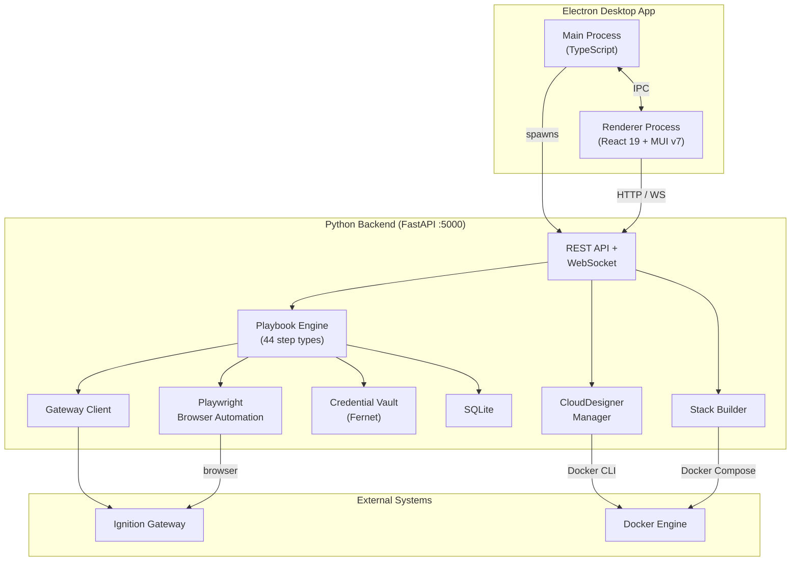

# Ignition Toolbox

A distributable desktop application for visual acceptance testing of Ignition SCADA systems. Run playbooks against Gateways, Perspective sessions, and Designers with real-time browser streaming, encrypted credentials, and full execution history.

## Architecture



<details>
<summary>ASCII diagram (non-GitHub contexts)</summary>

```
┌──────────────── Electron Desktop App ──────────────────┐
│  Main Process (TS)  ←──IPC──→  Renderer (React 19)    │
└────────┬───────────────────────────────┬───────────────┘
         │ spawns                        │ HTTP / WS
         ▼                              ▼
┌──────────────── Python Backend (FastAPI :5000) ────────┐
│  REST API + WebSocket                                  │
│  ├── Playbook Engine (44 step types)                   │
│  ├── Playwright Browser Automation                     │
│  ├── Gateway REST Client                               │
│  ├── Credential Vault (Fernet)                         │
│  ├── SQLite Database                                   │
│  ├── CloudDesigner Manager                             │
│  └── Stack Builder                                     │
└────────┬──────────────────────────────┬────────────────┘
         │                              │
         ▼                              ▼
  Ignition Gateway                Docker Engine
```

</details>

## Features

| Page | Description |
|------|-------------|
| **Playbooks** | Browse, duplicate, edit, and run YAML playbook library |
| **Executions** | Live execution monitoring with pause/resume/skip/cancel |
| **Execution Detail** | Step-by-step results, screenshots, and log output |
| **Credentials** | Fernet-encrypted credential vault for gateway/Perspective auth |
| **AI Credentials** | Manage API keys for Claude AI-assisted playbook creation |
| **Designer** | CloudDesigner: launch Ignition Designers in Docker containers |
| **Stack Builder** | Generate Docker Compose deployments for IIoT/SCADA infrastructure |
| **Baselines** | Visual baseline management for screenshot comparison testing |
| **API Explorer** | Interactive REST API browser for the backend |
| **Settings** | Application configuration and preferences |
| **About** | Version info, system status, and links |

## Run Modes

### 1. Electron App (production)

The standard way end-users run the application. Electron spawns the Python backend as a subprocess and serves the React frontend.

Install from [GitHub Releases](../../releases) or receive auto-update notifications in-app.

### 2. Plain Development Server

Run the backend and frontend separately for development:

```bash
# Terminal 1 - Python backend
cd backend && source .venv/bin/activate
python run_backend.py          # FastAPI on :5000

# Terminal 2 - React frontend
cd frontend && npm run dev     # Vite on :3000
```

### 3. Docker (optional)

```bash
docker compose up              # Backend + frontend in containers
```

## Quick Start (Development)

### Prerequisites

- Node.js 20+
- Python 3.10+
- npm

### Setup

```bash
# Install Node.js dependencies
npm install

# Install frontend dependencies
cd frontend && npm install && cd ..

# Create Python virtual environment and install deps
cd backend
python3 -m venv .venv
source .venv/bin/activate  # or .venv\Scripts\activate on Windows
pip install -r requirements.txt
cd ..
```

### Run

```bash
# Start both frontend and Electron (requires display)
npm run dev

# Or run components separately:
npm run dev:frontend      # Vite dev server (port 3000)
npm run dev:electron      # Electron with Python backend

# Backend only (headless, no Electron required)
cd backend && source .venv/bin/activate
python run_backend.py
```

## Release Process

**All production builds happen via GitHub Actions on `windows-latest` runners.**

```bash
# 1. Update version in package.json and frontend/package.json
# 2. Commit changes
# 3. Create and push a version tag:
git tag v1.5.1
git push origin v1.5.1
```

GitHub Actions (`build-windows.yml`) automatically builds the Windows installer with PyInstaller + electron-builder, publishes to GitHub Releases, and triggers auto-update notifications for existing users.

You can also trigger builds manually from the GitHub Actions UI (workflow_dispatch).

> **Note:** Do not use `npm run dist:win` for production releases. That script is for local development builds only and produces platform-specific binaries that depend on the build machine.

## Project Structure

```
ignition-toolbox/
├── electron/                      # Electron main process (TypeScript)
│   ├── main.ts                    # App entry, window creation
│   ├── preload.ts                 # Context bridge for IPC
│   ├── ipc/handlers.ts            # IPC handler registration
│   └── services/                  # Backend manager, updater, settings
│
├── backend/                       # Python backend
│   ├── ignition_toolkit/          # Main package
│   │   ├── api/                   # FastAPI REST API + WebSocket
│   │   ├── playbook/              # Playbook engine (44 step types)
│   │   ├── browser/               # Playwright browser automation
│   │   ├── gateway/               # Ignition Gateway REST client
│   │   ├── credentials/           # Fernet-encrypted credential vault
│   │   ├── storage/               # SQLite database
│   │   ├── clouddesigner/         # Docker-based Designer launcher
│   │   ├── stackbuilder/          # Docker Compose generator
│   │   ├── auth/                  # API key auth + RBAC
│   │   ├── execution/             # Parallel execution queue
│   │   └── reporting/             # Analytics and report exports
│   ├── playbooks/                 # Playbook library (YAML)
│   └── run_backend.py             # Subprocess entry point
│
├── frontend/                      # React 19 + TypeScript + MUI v7
│   ├── src/
│   │   ├── pages/                 # 11 pages (see Features table)
│   │   ├── components/            # Reusable UI components
│   │   ├── hooks/                 # WebSocket, playbook order hooks
│   │   ├── store/                 # Zustand global state
│   │   └── api/                   # HTTP API client
│   └── dist/                      # Built output
│
├── docs/                          # Documentation
├── .claude/                       # Claude Code configuration
├── package.json                   # Electron + build config
└── electron-builder.yml           # Distribution config
```

## Documentation

| Document | Description |
|----------|-------------|
| [Developer Guide](docs/DEVELOPER_GUIDE.md) | Setup, development workflow, testing |
| [Architecture](ARCHITECTURE.md) | System design and ADRs |
| [Project Goals](PROJECT_GOALS.md) | Vision and decision framework |
| [API Guide](docs/API_GUIDE.md) | REST and WebSocket API reference |
| [Playbook Syntax](docs/playbook_syntax.md) | YAML playbook reference |
| [Security](SECURITY.md) | Security architecture and best practices |
| [Versioning](docs/VERSIONING_GUIDE.md) | Version scheme and release process |
| [Troubleshooting](docs/TROUBLESHOOTING.md) | Common issues and solutions |

## License

MIT
